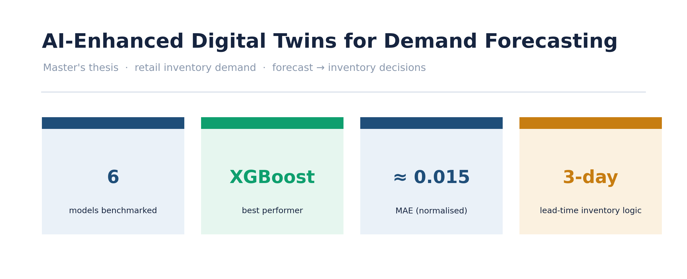
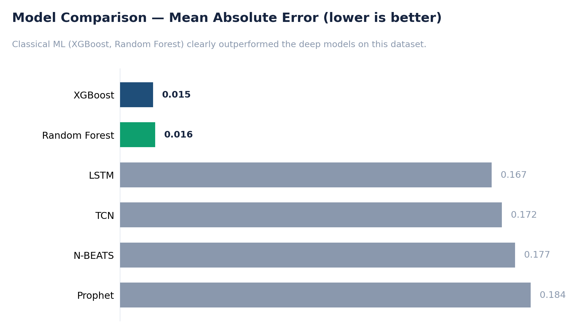
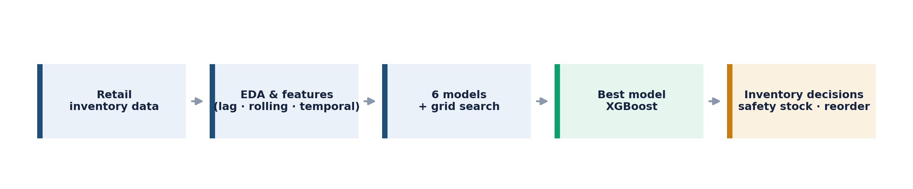

# 📦 AI-Enhanced Digital Twins for Demand Forecasting

A demand-forecasting **digital twin** that benchmarks six time-series models on retail
store inventory data and converts the best forecast into concrete inventory decisions —
safety stock, reorder points, and stockout / overstock risk flags. *(Master's thesis project.)*

> **Business question:** *How accurately can we forecast retail demand — and how do we turn
> that forecast into inventory decisions that prevent both stockouts and overstock?*



---

## 🔑 Key Results

| Area | Result |
|---|---|
| 🧪 Models | Benchmarked **6 models** — Random Forest, XGBoost, N-BEATS, TCN, LSTM, Prophet |
| 🏆 Best model | **XGBoost** — MAE ≈ **0.0148** (validation) / ≈ **0.0175** (test) on normalised demand |
| 🥈 Runner-up | Random Forest (MAE ≈ 0.0158) — classical ML beat the deep models on this dataset |
| 🧱 Features | Lag (1 / 7 / 30-day), rolling mean & std (7 / 30-day), and temporal (day/week/month/year) features |
| 📦 Inventory layer | **Safety-stock** and **reorder-point** logic on a 3-day lead time |
| ⚠️ Risk flags | Visual **stockout** (demand > inventory) and **overstock** zones for proactive planning |

---

## 🗂️ Pipeline

The full workflow runs end-to-end in a single notebook, in these stages:

| Stage | What it does |
|---|---|
| Data exploration & cleaning | Load retail inventory data, type fixes, normalise numerical features |
| EDA | Monthly resampling, seasonal decomposition, correlation heatmap, distribution & **IQR outlier** removal |
| Stationarity testing | Differencing + **ADF test**, ACF / PACF to characterise the series |
| Feature engineering | Lag, rolling-window and temporal features; 80/20 chronological split |
| Model training | Six models with **grid-search tuning**, compared on MAE via the Darts framework |
| Best-model selection & forecast | Select XGBoost, forecast future demand on the test horizon |
| Inventory management | Safety stock, reorder point, and stockout/overstock risk visualisation |

---

## 📊 Visual Highlights

**The six benchmarked models, ranked by error — classical ML (XGBoost, Random Forest) won decisively.**



**End-to-end pipeline — from raw inventory data through to safety-stock and reorder decisions.**



---

## 🧰 Tech Stack

`Python` · `pandas` · `numpy` · `scikit-learn` · `XGBoost` · `Darts` · `TensorFlow/Keras` · `Prophet` · `statsmodels` · `Matplotlib` · `Seaborn`

---

## ▶️ How to Run

```bash
# 1. Clone
git clone https://github.com/shashank-s-k/Digital-Twins-Forecasting.git
cd Digital-Twins-Forecasting

# 2. (Recommended) create a virtual environment
python -m venv .venv
source .venv/bin/activate          # Windows: .venv\Scripts\activate

# 3. Install dependencies
pip install pandas numpy matplotlib seaborn scikit-learn xgboost darts prophet statsmodels

# 4. Launch Jupyter and run the notebook top to bottom
jupyter lab
```

**Dataset:** [Retail Store Inventory Forecasting Dataset (Kaggle)](https://www.kaggle.com/datasets/anirudhchauhan/retail-store-inventory-forecasting-dataset) — download and place the CSV alongside the notebook (or update the path in the first cell).

---

## 📁 Repository Structure

```
Digital-Twins-Forecasting/
├── Digital Twins Forecasting.ipynb   # full pipeline: EDA → features → 6 models → inventory
├── data/                             # Kaggle dataset (or update path in notebook)
├── reports/
│   └── figures/                      # exported PNG charts used in this README
├── requirements.txt
└── README.md
```
*Adjust filenames to match your repo.*

---

## ⚖️ Methodology Notes (the honest bits)

- **MAE is on MinMax-normalised demand (0–1 scale)**, so the absolute values are small by
  construction — read them as a *relative* ranking between models, not as raw units sold.
- **Classical ML won here:** XGBoost and Random Forest with engineered lag/rolling features
  outperformed the deep models (N-BEATS, TCN, LSTM) — a useful reminder that bigger isn't
  always better, especially at this dataset size.
- **Time order is respected:** an 80/20 *chronological* split (no shuffling), so the model is
  always evaluated on genuinely unseen future data.
- **Inventory parameters are illustrative:** the 3-day lead time and resulting safety-stock /
  reorder points are explicit, editable assumptions — sized to demonstrate the decision layer,
  not to prescribe a specific operation.
